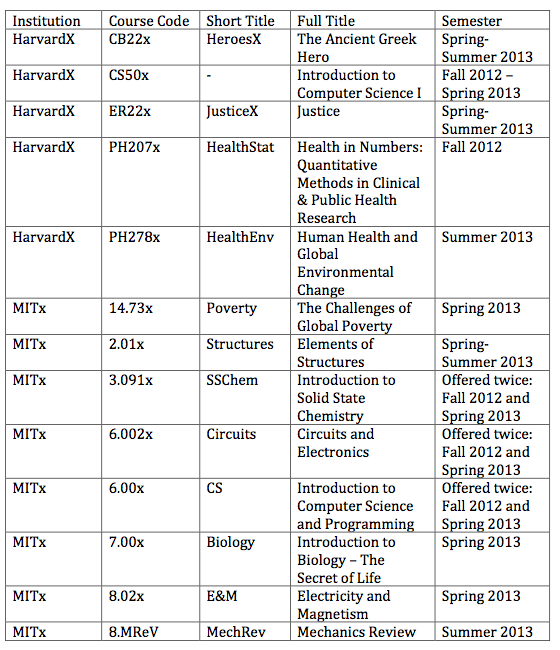

```{r libraries, message=FALSE, warning=FALSE}
library(dplyr)
library(ggplot2)
library(tidyr)
library(scales)
library(gridExtra)
library(extrafont)
```

[Github Source Code](https://github.com/FCH808/FCH808.github.io/tree/master/Data%20Analysis%20with%20R/Project) and [Up-to-date Nanodegree Projects](http://fch808.github.io/) are available.

## Introduction

EdX is a massive open online course (MOOC) provider and nonprofit online learning provider. It is available world-wide, mostly at no charge. Along with [Coursera](https://www.coursera.org/)  and [Udacity](https://www.udacity.com/) , it is one of three major MOOC providers. Edx was founded by MIT and Harvard in May 2012 and as of October 22, 2014, has over 3 million users taking 300 offered courses online. [[1]](http://en.wikipedia.org/wiki/EdX) 

On May 30, 2014 MIT and Harvard released de-identified data from 13 HarvardX and MITx courses offered in the inaugural 2012-13 time period.[[2]](http://newsoffice.mit.edu/2014/mit-and-harvard-release-de-identified-learning-data-open-online-courses) 

This data contains records from 476,532 students covering 641,138 separate course registrations.[[3]](http://thedata.harvard.edu/dvn/dv/mxhx) 

## Initial Exploration and Data Cleanup

This data set provides demographic and anonymized online activity data, including final grades.

When exploring a new dataset, it's always a good idea to start with a look at the structure of the data with str(). 

```{r load_data, warning=FALSE,message=FALSE}

setwd("data")
mooc_data <- tbl_df(read.csv("HMXPC13_DI_v2_5-14-14.csv", na.strings = c("NA", "")))

dim(mooc_data)

str(mooc_data)
```

The exact meanings of the variables can looked up in the "Person Course Documentation.pdf". First, let's tidy up the data a bit by separating course_id, which contains 3 different types of information, into 3 separate columns. We can also add Age using the user-provided birth year. [3]

We will then add the full title of the courses based on the Course Codes from the "Person Course Documentation.pdf".



```{r warning=FALSE,message=FALSE}
levels(mooc_data$course_id)

levels(mooc_data$gender) <- c("Female", "Male", "Other")

mooc_data <- mooc_data %>%
  separate(course_id, into = c("Institution", "Course_Code", "Semester"), sep="/", convert=TRUE) %>%
  rename(Country = final_cc_cname_DI,
         Level_of_Edu = LoE_DI,
         Registration_Date = start_time_DI,
         Last_Interaction = last_event_DI) %>%
    mutate(Age = 2014 - YoB,
         certified = factor(certified, labels=c("No", "Yes")),
         Level_of_Edu = factor(Level_of_Edu, levels = c("Less than Secondary", "Secondary", "Bachelor's", "Master's", "Doctorate")))

## Add in full course titles from codebook.[3]
course_names <- data.frame("Course_Code" = factor(c("CB22x", "CS50x", "ER22x", "PH207x", "PH278x", "14.73x",
                                             "2.01x", "3.091x", "6.002x", "6.00x", "7.00x", "8.02x", "8.MReV")),
                           "Full_Title" = c("The Ancient Greek Hero", "Intro to Computer Science I",
                                            "Justice", "Health in #'s: Quant. Methods", 
                                            "Human Hlth & Glob Envir Chng",
                                            "Challenges of Glob. Poverty", "Elements of Structures",
                                            "Intro to Solid State Chem.", "Circuits and Electronics",
                                            "Intro to C.S. & Programming", "Intro to Biology",
                                            "Electricity and Magnetism", "Mechanics Review"))

mooc_data <- left_join(mooc_data, course_names, by="Course_Code")

mooc_data <- mooc_data %>%
  mutate(letter_grade = cut(grade, breaks=c(0.00, 0.01, .49, .59, .69, .79, .89, 1.01), include.lowest = TRUE, ordered_result = FALSE))


# Add in School Colors for plots
# http://web.mit.edu/graphicidentity/colors.html
# http://www.hbs.edu/marketing/color.html

mooc_data <- mooc_data %>%
  mutate(School_Color = ifelse(Institution == "HarvardX", "#A41034", "#000000"))

school_colors <- mooc_data$School_Color
names(school_colors) <- mooc_data$Institution

```

## Univariate Exploration

This dataset contains data for 641,138 course registrations

476,532 unique students showing some students were registered for multiple courses in this dataset.

```{r warning=FALSE, message=FALSE}

table(mooc_data$registered)
str(levels(mooc_data$userid_DI))

```
About 400,262 (62.4%) of students accessed the Courseware tab which contains the videos, problem sets, and exams.
This leaves 240,876 students who never did anything in the course after registering.

```{r, message=FALSE, warning=FALSE}

prop.table(table(mooc_data$viewed))
table(mooc_data$viewed)
ggplot(mooc_data, aes(x=factor(viewed))) + geom_histogram() + scale_y_continuous(labels=comma)

```

Only about 39,686 (6.2%) of students accessed at least half of the chapters for a given course.

```{r, warning=FALSE,message=FALSE}

prop.table(table(mooc_data$explored))
table(mooc_data$explored)
ggplot(mooc_data, aes(x=factor(explored))) + geom_histogram() + scale_y_continuous(labels=comma)
```

Only 17,687 (2.8%) of registered students completed a given course and received a certificate (earned 50%-80% depending on course)

```{r, message=FALSE, warning=FALSE}
prop.table(table(mooc_data$certified))
table(mooc_data$certified)
ggplot(mooc_data, aes(x=factor(certified))) + geom_histogram() + scale_y_continuous(labels=comma)

```

The US and India have the largest amounts of registered students

```{r, warning=FALSE, message=FALSE}

ggplot(mooc_data, aes(x=factor(Country))) + geom_histogram() + scale_y_continuous(labels=comma) + coord_flip()

```

The most common education level of experience is a bachelors degree. 

```{r, message=FALSE, warning=FALSE}

prop.table(table(mooc_data$Level_of_Edu))
table(mooc_data$Level_of_Edu)
ggplot(mooc_data, aes(x=Level_of_Edu)) + geom_histogram() + scale_y_continuous(labels=comma)

```

Classes all start on different dates, this information doesn't seem too useful by itself

```{r, message=FALSE, warning=FALSE}

ggplot(mooc_data, aes(x=Registration_Date)) + geom_histogram() + scale_y_continuous(labels=comma) 

```


199,151 (31%) students had 0 interactions beyond just registering
171,714 (26.8%) students had 10 or less interactions with the website beyond registration

```{r, warning=FALSE, message=FALSE}

prop.table(table(mooc_data$nevents<=10, useNA="always"))
table(mooc_data$nevents<=10, useNA="always")

g1 <- ggplot(mooc_data, aes(x=nevents)) + geom_histogram() + scale_y_continuous(labels=comma) + scale_x_log10() + xlab("Log10 Scale")
g2 <- ggplot(mooc_data, aes(x=nevents)) + geom_histogram(binwidth=10) + coord_cartesian(xlim=c(0, 500)) + scale_y_continuous(labels=comma) + xlab("Binwidth = 10; limit 500")
grid.arrange(g1, g2)
```

457,530 (71.4%) did not play any videos at all within courses. 11.1% played videos 10 or less times, while 17.5% played videos more than 10 times.This is slightly startling because most of the instruction for courses are presented by the videos. One reason for the large proportion may be because some courses allow downloads of videos which are more effective for slower/intermittent internet connections.

```{r, message=FALSE, warning=FALSE}

prop.table(table(mooc_data$nplay_video<=10, useNA="always"))
table(mooc_data$nplay_video<=10, useNA="always")

g1 <- ggplot(mooc_data, aes(x=nplay_video)) + geom_histogram() + scale_y_continuous(labels=comma) + scale_x_log10(labels=comma) + xlab("Log10 Scale")
g2 <- ggplot(mooc_data, aes(x=nplay_video)) + geom_histogram(binwidth=10) + coord_cartesian(xlim=c(0, 500)) + scale_y_continuous(labels=comma) + xlab("Binwidth = 10; limit 500")
grid.arrange(g1, g2)

```

162,743 (25.4%) did not interact with the course any days at all.
422,441 (65.9%) had interaction on 10 or less unique days.
This isn't much considering courses typically run 2-3 months long.
55,954 (8.7%) interacted with the courses on more than 10 unique days.
This may be a good indicator for how well a student ultimately does.

```{r, message=FALSE, warning=FALSE}

prop.table(table(mooc_data$ndays_act<=10, useNA="always"))
table(mooc_data$ndays_act<=10, useNA="always")
ggplot(mooc_data, aes(x=ndays_act)) + geom_histogram() + scale_y_continuous(labels=comma)

```

40.4% of students didn't interact with any chapters of the course.
Number of chapters varies per course so this statistic may be difficult to interpret.
19% of students only interacted with 1 chapter.

```{r, message=FALSE, warning=FALSE}
prop.table(table(mooc_data$nchapters<=1, useNA="always"))
table(mooc_data$nchapters<=1, useNA="always")
ggplot(mooc_data, aes(x=nchapters)) + geom_histogram() + scale_y_continuous(labels=comma)

```

Very few students make any forum posts.
Only 7461 (1.2%) made any posts at all. 633,677 (98.8%) were either lurkers or did not visit the forums.

```{r,message=FALSE, warning=FALSE}

prop.table(table(mooc_data$nforum_posts==0, useNA="always"))
table(mooc_data$nforum_posts<=0, useNA="always")
ggplot(mooc_data, aes(x=nforum_posts)) + geom_histogram() + scale_y_continuous(labels=comma)

```

100,161 (15.6%) records showed some inconsistency between log tables of different variables.
This just shows that there is a bit of noise in the data, but overall it looks to be pretty consistent.

```{r, warning=FALSE, message=FALSE}

prop.table(table(mooc_data$incomplete_flag, useNA="always"))
table(mooc_data$incomplete_flag, useNA="always")

```

Mean age across the dataset is 28.75. Minimum of 1 and 592 people under 5 years old shows there may be some noise in the data. There are also 96,605 who did not enter a birth year.
Age shows a right skew with the midsection at 26-28, consistent with the largest group having a Bachelor's degree.


```{r, message=FALSE, warning=FALSE}

summary(mooc_data$Age)
table(mooc_data$Age<=5)
ggplot(mooc_data, aes(x=Age)) + geom_bar(binwidth=1, fill="orange", color="black") + scale_x_continuous(breaks=seq(0, 85, 5)) + scale_y_continuous(labels=comma) + ggtitle("Distribution of Ages for Registered Students")

```

Computer Science courses seem to be the most popular courses.

```{r, message=FALSE, warning=FALSE}
ggplot(mooc_data, aes(x=Full_Title)) + geom_histogram() + scale_y_continuous(labels=comma) + coord_flip()

```

MITx/HarvardX courses have roughly similar amounts of registered students in the dataset.

```{r,message=FALSE, warning=FALSE}

ggplot(mooc_data, aes(x=Institution)) + geom_histogram() + scale_y_continuous(labels=comma) + coord_flip()

```

##### Flagging Active Students as a feature.
Distributions may be very different for students who are at least somewhat active when compared to those who register but do little to nothing after.

```{r, warning=FALSE, message=FALSE}
ggplot(mooc_data, aes(x=grade)) + geom_freqpoly()
summary(mooc_data$grade)

# Limit to students who viewed the Courseware section at least once; viewed == 1 and
# had at least 1 interaction with the the course beyond registration; nevents > 0
mooc_data_active <- mooc_data %>%
  filter(viewed == 1 & nevents > 0)

ggplot(mooc_data_active, aes(x=grade)) + geom_freqpoly()

# Add the contraint that students had a final grade that was at least more than 0.0%; grade > 0.0
mooc_data_active <- mooc_data %>%
  filter(viewed == 1 & nevents > 0 & grade > 0.0)

ggplot(mooc_data_active, aes(x=grade)) + geom_freqpoly()

# Add the constraint that students explored at least 1/2 of the chapters of the course in the Courseware; explored == 1
mooc_data_active <- mooc_data %>%
  filter(viewed == 1 & nevents > 0 & grade > 0.0 & explored == 1)

ggplot(mooc_data_active, aes(x=grade)) + geom_freqpoly()
```

##### Based on this exploration, it might be a good idea to create a new variable, Active_User, based on course activity.

Active Users will be defined as registered users who:

1. Viewed the Courseware section at least once; viewed == 1
2. Had at least 1 interaction with the the course beyond registration; nevents > 0
3. Explored at least 1/2 of the chapters of the course in the Courseware; explored == 1
4. Had a final grade that was at least more than 0.0%; grade > 0.0

Note: #4 has some implications for HarvardX Intro to CS I, since that course is pass/fail (0.0%/100.0%) with a threshold of 50% to receive passing certificate.

```{r, warning=FALSE, message=FALSE}

# Add Active_User as a feature
mooc_data <- mooc_data %>%
  mutate(Active_User = ifelse( (viewed == 1 & nevents > 0 & explored == 1 & grade > 0.0), 1, 0),
         Active_User = factor(Active_User, labels=c("Not Active", "Active")))


```

There are a relatively small group who have no information for any of these features, but most students can be categorized as Active or No Active
There are 26,463 active students with 613,744 who were not active.
931 students had no information available in all 4 criteria.

```{r, message=FALSE, warning=FALSE}
table(mooc_data$Active_User, useNA="always")

```

About 4.1% of online students meet the criteria for being an active student

```{r, message=FALSE, warning=FALSE}
prop.table(table(mooc_data$Active_User))

ggplot(subset(mooc_data, !is.na(Active_User)), aes(x=Active_User)) + geom_histogram()

```

## Multivariate Exploration

```{r warning=FALSE,message=FALSE}

# Certified/Active
ggplot(subset(mooc_data, !is.na(Active_User)), aes(x=certified)) + geom_bar() + facet_wrap(~Active_User, scales = "free") + scale_y_continuous(labels=comma)

# Grades of Active Users

ggplot(subset(mooc_data, Active_User == "Active"), aes(x=grade)) + geom_freqpoly(aes(color=Institution), binwidth=0.01)
ggplot(subset(mooc_data, Active_User == "Active"), aes(x=grade)) + geom_freqpoly(aes(color=Full_Title), binwidth=0.01)
ggplot(subset(mooc_data, Active_User == "Active"), aes(x=grade)) + geom_freqpoly(aes(color=Country), binwidth=0.01)
ggplot(subset(mooc_data, Active_User == "Active"), aes(x=grade)) + geom_freqpoly(aes(color=gender), binwidth=0.01)
ggplot(subset(mooc_data, Active_User == "Active"), aes(x=grade)) + geom_freqpoly(aes(color=Level_of_Edu), binwidth=0.01)

```

A small of users below 10 years old looks suspect. 
There's an interesting split at 50%. 

```{r, message=FALSE, warning=FALSE}
ggplot(mooc_data, aes(x=Age, y=grade)) + geom_jitter(aes(color=Institution), alpha=1/10) + scale_y_continuous(labels=percent, breaks=seq(0, 1, 0.1)) + scale_x_continuous(breaks=seq(0, 80, 10)) + scale_color_manual(values = school_colors)

# Popularity
ggplot(mooc_data, aes(x=Full_Title)) + geom_histogram(aes(fill = Institution)) + theme(axis.text.x=element_text(angle=90, size=9)) + scale_fill_manual(values = school_colors) + coord_flip() + theme_minimal()

# Gender Enrollment
ggplot(subset(mooc_data, (!is.na(gender) & gender != "Other")), aes(x=Full_Title)) + geom_histogram(aes(fill=gender), position="dodge", color="black") + theme_minimal() + theme(axis.text.x=element_text(angle=90, size=9)) + coord_flip()

# Active User/Certification/Edu
ggplot(subset(mooc_data, !is.na(Active_User)), aes(x=Level_of_Edu)) + geom_bar(aes(fill=certified), position="dodge") + facet_wrap(~Active_User, scales = "free") + scale_y_continuous(labels=comma)

```

CS50 is a pass/fail 0%/100% course. Average scores are very low when all registered students are included. 
It may be better to look at active students to get a better feel for student performance since so many registered but didn't do anything in the course.


```{r,message=FALSE,warning=FALSE}
mooc_summary_any <- mooc_data %>%
  filter(!is.na(grade)) %>%
  group_by(Full_Title, Institution) %>%
  summarise(avg_grade_any = mean(grade),
            n_any = n())

mooc_summary_active <- mooc_data %>%
  filter(!is.na(grade),
         Active_User == "Active") %>%
  group_by(Full_Title, Institution) %>%
  summarise(avg_grade_active = mean(grade),
            n_active = n())

mooc_summary <- left_join(mooc_summary_any, mooc_summary_active) %>%
  mutate(active_perc = n_active/n_any)

ggplot(mooc_summary, aes(x=reorder(Full_Title, avg_grade_any), y=avg_grade_any)) + geom_bar(aes(fill=Institution), stat="identity") + theme(axis.text.x=element_text(angle=90, size=9)) + scale_fill_manual(values = school_colors) + coord_flip() + theme_minimal() + scale_y_continuous(labels=percent) + ggtitle("Among All Registered Users")

```

What about among Active Users? Since Intro to CS1 is pass/fail, anyone who is active does not have 0.0 as a grade, and must have full 100% causing the average to be 100%.

```{r, message=FALSE, warning=FALSE}
ggplot(mooc_summary, aes(x=reorder(Full_Title, avg_grade_active), y=avg_grade_active)) + geom_bar(aes(fill=Institution), stat="identity") + theme(axis.text.x=element_text(angle=90, size=9)) + scale_fill_manual(values = school_colors) + coord_flip() + theme_minimal() + scale_y_continuous(labels=percent) + ggtitle("Among Active Users")

```

An interesting thing to note here is that the most popular course for registrations, Intro to Science Science I, had by far the lowest percentage of active users.

```{r, warning=FALSE, message=FALSE}
ggplot(mooc_summary, aes(x=reorder(Full_Title, active_perc), y=active_perc)) + geom_bar(aes(fill=Institution), stat="identity") + theme(axis.text.x=element_text(angle=90, size=9)) + scale_fill_manual(values = school_colors) + coord_flip() + theme_minimal() + scale_y_continuous(labels=percent) + ggtitle("% of Active Users per Course")

```

Number of events and video plays don't seems to have a very high correlation with overall grades.

```{r, message=FALSE, warning=FALSE}
ggplot(mooc_data, aes(x=nevents, y=grade)) + geom_jitter(alpha=1/10)

ggplot(mooc_data, aes(x=nplay_video, y=grade)) + geom_jitter(alpha=1/10)

```

But number of unique days logged in and number of chapters viewed show some correlation.

```{r, message=FALSE, warning=FALSE}

ggplot(mooc_data, aes(x=ndays_act, y=grade)) + geom_jitter(alpha=1/10)

ggplot(mooc_data, aes(x=nchapters, y=grade)) + geom_jitter(alpha=1/10)

ggplot(mooc_data, aes(x=nforum_posts, y=grade)) + geom_jitter(alpha=1/10)

```

```{r, warning=FALSE, message=FALSE}

# Age and gender
# Summary Statistics for Age by gender are very similar.
by(mooc_data$Age, mooc_data$gender, summary)


# Certified percentages
ggplot(mooc_data, aes(x=certified, y=..count../sum(..count..))) + geom_bar() + scale_y_continuous(labels=percent)

# Countries

country_grade <- mooc_data %>%
  filter(!is.na(grade)) %>%
  group_by(Country) %>%
  summarise(avg_grade = mean(grade))

# Average grade
ggplot(country_grade, aes(x=reorder(Country, avg_grade), y=avg_grade)) + geom_bar(stat="identity") + coord_flip()

# Among Active Users, there isn't much of a difference in final grades distributions
edu_grade <- mooc_data %>%
  filter(Active_User == "Active") %>%
  group_by(Level_of_Edu) %>%
  summarise(avg_grade = mean(grade))

ggplot(edu_grade, aes(x=Level_of_Edu, y=avg_grade)) + geom_bar(stat="identity")

# There are so many student with 0.0 grade, that anything above is an outlier; 3rd quantile is still 0.0!
summary(mooc_data$grade)
ggplot(mooc_data, aes(x=Level_of_Edu, y=grade, fill=Level_of_Edu)) + geom_boxplot()

# Just filtering out students with a grade of 0.0 shows the distributions better
ggplot(subset(mooc_data, grade > 0.0), aes(x=Level_of_Edu, y=grade, fill=Level_of_Edu)) + 
  geom_boxplot() +
  scale_y_continuous(breaks=seq(0, 1, .05)) +
  scale_fill_brewer(type="seq", palette=5) + 
  theme_minimal() +
  stat_summary(fun.y=median, colour="black", geom="text", show_guide = FALSE, vjust=-0.7, 
               aes( label=round(..y.., digits=2))) + 
  stat_summary(fun.y=mean, colour="black", geom="point", show_guide = FALSE, vjust=-0.7, shape=23, size=3)

table(mooc_data$letter_grade)

ggplot(subset(mooc_data, letter_grade != "[0,0.01]"), aes(x=letter_grade)) + geom_histogram() 

ggplot(subset(mooc_data, letter_grade != "[0,0.01]"), aes(x=letter_grade, y=Age)) + geom_boxplot()

ggplot(subset(mooc_data, letter_grade != "[0,0.01]"), aes(x=grade, color=Level_of_Edu)) + geom_density(position="dodge")


```

# Analysis

## Percentage Who Earned Completion Certificates

### How many students earned certificates?

Only 2.8% of registered students passed their respective courses.

```{r, warning=FALSE, message=FALSE}

cert <- mooc_data %>%
  filter(!is.na(certified)) %>%
  group_by(certified) %>%
  summarise(n=n()) %>%
  mutate(perc = n/sum(n))

completion <- ggplot(cert, aes(x=certified, y=perc, fill=certified)) + 
  geom_histogram(stat="identity", color="black") + 
  scale_y_continuous(labels=percent) +
  geom_text(aes(family="mono", fontface="bold", y=perc, label=paste(round(perc, 3)*100, "%", sep="")),
            color="black", size=6, vjust = -0.1) +
  scale_fill_manual(values=c("dodgerblue4", "goldenrod1")) + 
  ggtitle("Percentage of Registered Students\nThat Earned Certificates") + xlab("Earned Certification?") + ylab("Percentage Who Earned Certification") +
  theme(text=element_text(family="mono"))
  
completion
```

Female students had a slightly higher course completion percentage, but overall, there wasn't a large difference in completion rate between the sexes.

```{r, message=FALSE, warning=FALSE}

mooc_gender <- mooc_data %>%
  filter(!is.na(gender),
         gender != "Other") %>%
  group_by(certified, gender) %>%
  summarise(n=n()) %>%
  group_by(gender) %>%
  mutate(percentage = n/sum(n))

ggplot(mooc_gender, aes(x=certified, y=percentage, fill=certified)) + geom_bar(stat="identity", color="black") +
  scale_y_continuous(labels=percent) + facet_wrap(~gender) + 
  geom_text(aes(family="mono", fontface="bold", y=percentage, label=paste(round(percentage, 3)*100, "%", sep="")),
            color="black", size=6, vjust = -0.1) +
  theme_minimal() + ggtitle("Percentage of Registered Students\nThat Earned Certificates by Gender") +
  scale_fill_manual(values=c("dodgerblue4", "goldenrod1")) +
  xlab("Earned Certification?") + ylab("Percentage Who Earned Certification") +
  theme(text=element_text(family="mono"))
```

When it comes to student location, Spain and Poland lead the pack for earning certificates of completion.

```{r, message=FALSE,warning=FALSE}
country_cert <- mooc_data %>%
  group_by(Country, certified) %>%
  summarise(n = n()) %>%
  group_by(Country) %>%
  mutate(perc = n/sum(n))

completionCountry <- ggplot(subset(country_cert, certified=="Yes"), aes(x=reorder(Country, perc), y=perc)) +
  geom_bar(stat="identity", fill="#A31F34") +
  coord_flip() +
  scale_y_continuous(labels = percent) + 
  geom_text(aes(family="mono", fontface="bold", y=perc, label=paste(round(perc, 3)*100, "%", sep="")),
            color="white", size=3, hjust=1.5) + 
  theme_minimal() + ggtitle("Course Completion % by Country") +
  theme(text=element_text(family="Calibri")) + ylab("Percentage Who Earned Certification") + xlab("Country")

completionCountry

```

## Course Enrollment

### What are the most popular courses?

Introductory courses for Computer Science and Programming are by far the most popular courses.

```{r, warning=FALSE, message=FALSE}
mooc_pop <- mooc_data %>%
  group_by(Full_Title, Institution) %>%
  summarise(n = n())

popAll <- ggplot(mooc_pop, aes(x=reorder(Full_Title, n), y=n, fill=Institution)) +
  geom_bar(stat="identity") +
  theme(axis.text.x=element_text(angle=90, size=9)) +
  scale_fill_manual(values = school_colors) + 
  coord_flip() + 
  theme_minimal() + 
  scale_y_continuous(labels=comma) + 
  ggtitle("Number of Registered Users per Course") + xlab("Course Name") + ylab("# of Regsitered Users") +
  theme(text=element_text(family="Calibri"))

popAll
```

Almost 3 times more males registered for courses than females.

But was there a difference in registered courses by gender?

```{r, warning=FALSE, message=FALSE}
ggplot(subset(mooc_data, (!is.na(gender) & gender != "Other")), aes(x=gender, fill=gender) ) +
  geom_bar(color="black") +
  theme_minimal() +
  scale_y_continuous(labels=comma) +
  scale_fill_manual(values=c("#CC79A7", "#56B4E9")) + 
  ggtitle("Course Enrollment by Gender") + xlab("Gender") + ylab("Count") +
  theme(text=element_text(family="Calibri"))

```

The two most popular courses overall were also most popular for males. 

Courses closer to the Humanities nearly identical gender ratios while hard sciences were male-dominated in course registrations.

```{r, warning=FALSE, message=FALSE}
gender_enroll <- mooc_data %>%
  filter(!is.na(gender), 
         gender != "Other") %>%
  group_by(Full_Title, gender, Institution) %>%
  summarise(n = n()) 

ge1 <- ggplot(gender_enroll, aes(x=reorder(Full_Title, n), y=n, fill=gender) ) +
  geom_bar(stat="identity", position="dodge", color="black") +
  theme_minimal() +
  coord_flip() + 
  scale_y_continuous(labels=comma) +
  scale_fill_manual(values=c("#CC79A7", "#56B4E9"), name="Gender") + 
  ggtitle("Course Enrollment by Gender") + xlab("Course Name") + ylab("# of Enrollments") + 
  theme(text=element_text(family="Calibri"))

ge1

```

The U.S. has by far the most registered students (28.7%), with India(13.8%) and Unknown/Other(12.8%) being the 2nd and 3rd most popular choices for country.


```{r,message=FALSE,warning=FALSE}
country_pop <- mooc_data %>%
  group_by(Country) %>%
  summarise(n = n()) %>%
  mutate(perc = n/sum(n)) %>%
  arrange(-n)

countryEnroll <- ggplot(country_pop, aes(x=reorder(Country, n), y=n) ) +
  geom_bar(stat="identity", position="dodge", color="black", fill="#A31F34") +
  theme_minimal() +
  coord_flip() + 
  scale_y_continuous(labels=comma, breaks=seq(0, 200000, 25000), limits=c(0, 200000)) +
  ggtitle("Course Enrollment by Country") + xlab("Country") + ylab("# of Enrollments") + 
  theme(text=element_text(family="Calibri"), axis.text.x = element_text(angle = 45, hjust = 1)) +
  geom_text(aes(family="mono", fontface="bold", y=n, label=paste(round(perc, 3)*100, "%", sep="")),
            color="black", size=3, hjust=-.1)

countryEnroll

```


# Age

## What are the age distributions like for students?

Most registered students were between 20 and 28, with quite a few older students in a right-tailed distribution.

```{r, warning=FALSE, message=FALSE}

ggplot(mooc_data, aes(x=Age)) + 
  geom_bar(binwidth=1, fill="orange", color="black") + 
  scale_x_continuous(breaks=seq(0, 85, 5)) + 
  scale_y_continuous(labels=comma) +
  ggtitle("Distribution of Ages for Registered Students") + xlab("Age") + ylab("Count") + 
  theme(text=element_text(family="Calibri")) + 
  theme_minimal()

```

If we look at a density plot of the distributions of age by gender (for those over 10 years of age), we can see more male students in the 17-22 age range, and more women in the 25-30 year old range.

```{r, warning=FALSE,message=FALSE}
ggplot(subset(mooc_data, gender != "Other" & Age > 10), aes(x=Age, fill=gender)) + 
  geom_density(binwidth=1, alpha=0.2) +  
  #coord_cartesian(xlim=c(12, 60))
  scale_x_continuous(breaks=seq(0, 85, 5)) + 
  scale_y_continuous(labels=percent) +
  scale_fill_manual(values=c("#CC79A7", "#56B4E9")) + 
  ggtitle("Distribution of Ages for Registered Students by Gender") + xlab("Age") + ylab("Count") + 
  theme(text=element_text(family="Calibri")) + 
  theme_minimal()

```

When we look at active users, this difference becomes much more apparent. The male percentage of students peaks at 21, while female percentage peaks at around 27. This will prove to be important information when we look at the distribution of education levels among genders.


```{r}
ageGender <- ggplot(subset(mooc_data, gender != "Other" & Age > 10 & Active_User == "Active"), aes(x=Age, fill=gender)) + 
  geom_density(binwidth=1, alpha=0.5) +  
  scale_x_continuous(breaks=seq(10, 85, 5)) + 
  scale_y_continuous(labels=percent) +
  scale_fill_manual(values=c("#CC79A7", "#56B4E9")) + 
  ggtitle("Distribution of Ages for Registered Students by Gender\n for Active Students over 10 years of age") + xlab("Age") + ylab("Count") + 
  theme(text=element_text(family="Calibri")) + 
  theme_minimal()

ageGender

```


The U.S., Spain, Nigeria, and Japan had the oldest population of registered students while Morocco, Egypt, and India had the youngest populations of registered students.

```{r,message=FALSE,warning=FALSE}
country_age <- mooc_data %>%
  filter(!is.na(Age)) %>%
  group_by(Country) %>%
  summarise(avg_age = mean(Age)) 

countryAge <- ggplot(country_age, aes(x=reorder(Country, avg_age), y=avg_age)) +
  geom_bar(stat="identity", fill="#A31F34") +
  coord_flip(ylim=c(22, 34)) +
  geom_text(aes(family="mono", fontface="bold", y=avg_age, 
                label=round(avg_age, 2)), color="white", size=3, hjust=1.2) +
  ggtitle("Avg. Age for Registered Users by Country") + xlab("Country") + ylab("Average Age") + 
  theme(text=element_text(family="Calibri"))


countryAge
```

# Education

Most students who register have a bachelor's degree. 

This remains true when filtering out only active users, although post-graduate degree percentages increase among active users.

```{r, warning=FALSE, message=FALSE}

edu <- mooc_data %>%
  filter(!is.na(Level_of_Edu)) %>%
  group_by(Level_of_Edu) %>%
  summarise(n=n()) %>%
  mutate(perc = n/sum(n))

e1 <- ggplot(edu, aes(x=Level_of_Edu, y=perc)) + 
  geom_bar(stat="identity", fill="#A31F34", color="black") +
  scale_y_continuous(labels=percent, limits=c(0, 0.50)) + 
  geom_text(aes(family="mono", fontface="bold", y=perc, label=paste(round(perc, 3)*100, "%", sep="")),
            color="black", size=5, vjust = -0.1)  +
  ggtitle("Percentage with each Education Level for All Registered Students") + ylab("Percentage") + xlab("Level of Education") +
  theme_minimal() + 
  theme(text=element_text(family="Calibri"))

edu2 <- mooc_data %>%
  filter(!is.na(Level_of_Edu),
         Active_User == "Active") %>%
  group_by(Level_of_Edu) %>%
  summarise(n=n()) %>%
  mutate(perc = n/sum(n))

e2 <- ggplot(edu2, aes(x=Level_of_Edu, y=perc)) +
  geom_bar(stat="identity", fill="#A31F34", color="black") +
  scale_y_continuous(labels=percent, limits=c(0, 0.50)) + 
  geom_text(aes(family="mono", fontface="bold", y=perc, label=paste(round(perc, 3)*100, "%", sep="")),
            color="black", size=5, vjust = -0.1) + 
  ggtitle("Percentage with each Education Level for Active Users") + ylab("Percentage") + xlab("Level of Education") +
  theme_minimal() + 
  theme(text=element_text(family="Calibri"))

grid.arrange(e1, e2)
```

Within each gender, males have noticeably higher percentages of registered students in Secondary school and while female have higher percentages of students with master's degrees. This difference becomes more pronounced among active users. This shouldn't be too surprising since the density percentage of males peaked around 21, while females peaked around 27.

```{r, message=FALSE, warning=FALSE, fig.height=8, fig.width=12}

mooc_edu1 <- mooc_data %>%
  filter(!is.na(Level_of_Edu),
         !is.na(gender),
         gender != "Other") %>%
  group_by(gender, Level_of_Edu) %>%
  summarize(n=n()) %>%
  mutate(perc = n/sum(n))

mooc_edu2 <- mooc_data %>%
  filter(!is.na(Level_of_Edu),
         !is.na(gender),
         Active_User == "Active",
         gender != "Other") %>%
  group_by(gender, Level_of_Edu) %>%
  summarize(n=n()) %>%
  mutate(perc = n/sum(n))

plotEdu <- function(data=NULL, Title=NULL){
  ggplot(data, aes(x=Level_of_Edu, y=perc, fill=gender)) +
  geom_bar(stat="identity", position="dodge", color="black") +
  scale_fill_manual(values=c("#CC79A7", "#56B4E9")) +  
  geom_text(data=subset(data, gender=="Female"), 
            aes(family="mono", fontface="bold", y=perc, label=paste(round(perc, 3)*100, "%", sep="")), 
            color="#CC79A7", size=4, vjust = -0.2, hjust=1.3) +
  geom_text(data=subset(data, gender=="Male"), 
            aes(family="mono", fontface="bold", y=perc, label=paste(round(perc, 3)*100, "%", sep="")), 
            color="#56B4E9", size=4, vjust = -0.2, hjust=-0.3) +
  scale_y_continuous(labels=percent, breaks=seq(0,0.45,0.05), limits=c(0, 0.45)) + 
  theme_minimal() + 
  theme(text=element_text(family="Calibri")) + 
  ggtitle(Title) +
  ylab("Percentage within Gender") + xlab("Level of Education")
}

e3 <- plotEdu(data=mooc_edu1, Title="Percentage with each Education Level within each Gender for All Registered Students")
e4 <- plotEdu(data=mooc_edu2, Title="Percentage with each Education Level within each Gender for Active Students")

grid.arrange(e3, e4)

```

# Grades

And finally, we investigate how well do students do in the courses.

First, an age-old question: Who gets better grades - men or women?

Among active users, it's very close to an outright tie with only 1.8% difference in overall average grades.

```{r, message=FALSE, warning=FALSE}
mooc_gender_active_grade <- mooc_data %>%
  filter(!is.na(gender),
         gender != "Other",
         Active_User == "Active") %>%
  group_by(gender) %>%
  summarise(avg_grade = mean(grade, na.rm=TRUE),
            n=n())

ggplot(mooc_gender_active_grade, aes(x=gender)) + geom_bar(aes(fill=gender, y=avg_grade), stat="identity") +
  coord_flip() + 
  scale_y_continuous(labels=percent) +
  geom_text(aes(family="mono", fontface="bold", y=avg_grade, label=paste(round(avg_grade, 3)*100, "%", sep="")),
            color="white", size=10, hjust=1) + 
  ggtitle("Average Grade by Gender for Active Users") + ylab("Average Grade") + xlab("Gender") +
  scale_fill_manual(values=c("#CC79A7", "#56B4E9")) + 
  theme_minimal() + 
  theme(text=element_text(family="Calibri"))
```

But with different genders being drawn to different courses, how did grades differ between the different classes?

Women did slightly better in many of the classes that were dominated by male registrants. It also seems that the larger numbers of males passing Intro to CS I (100% pass/fail course) may have helped boost overall male grade % a bit.

We can also see that Electricity and Magnetism was the hardest course for active students.

Note: Again, Intro to CS I was pass/fail so the average grade for active users here is 100%.

```{r, message=FALSE, warning=FALSE}
mooc_gender_active <- mooc_data %>%
  filter(!is.na(gender),
         gender != "Other",
         Active_User == "Active") %>%
  group_by(Full_Title, gender, Institution) %>%
  summarise(avg_grade = mean(grade, na.rm=TRUE),
            n=n())

ge2 <- ggplot(mooc_gender_active, aes(x=reorder(Full_Title, avg_grade), y=avg_grade, fill=gender) ) +
  geom_bar(stat="identity", position="dodge", color="black") +
  theme_minimal() +
  coord_flip() + 
  scale_y_continuous(labels=percent, breaks=seq(0, 1, 0.1)) +
  scale_fill_manual(values=c("#CC79A7", "#56B4E9"), name="Gender") + 
  ggtitle("Average Grades per Course by Gender for Active Users") + xlab("Course Name") + ylab("Average Grade in Course") +
  theme(axis.text.x = element_text(angle = 45, hjust = 1)) + 
  theme(text=element_text(family="Calibri"))

ge2
```

Averages grades by age for active users stayed fairly consistent until around 50 years of age where average grades become erratic. This is probably due in part to the right-skew of the data causing there to be less data available for ages 50+.

We can see the min/max in the lighter bands of color, while the IQR is represented by the darker bands.

```{r, message=FALSE, warning=FALSE}
age_grades <- mooc_data %>%
  filter(!is.na(grade),
         Active_User == "Active",
         Age > 5) %>%
  group_by(Age) %>%
  summarise(avg_grade = mean(grade),
            median_grade = median(grade),
            sd = sd(grade),
            lower = min(grade),
            upper = max(grade),
            quant.25 = quantile(grade, probs=0.25, na.rm=TRUE),
            quant.75 = quantile(grade, probs=0.75, na.rm=TRUE),
            n = n())

p <- ggplot(age_grades, aes(x=Age, y=avg_grade)) + 
  theme(plot.background = element_blank(),
                panel.grid.minor = element_blank(),
                panel.grid.major = element_blank(),
                panel.border = element_blank(),
                panel.background = element_blank(),
                axis.ticks = element_blank(),
                axis.title = element_blank()) +
  geom_linerange(age_grades, mapping=aes(x=Age, ymin=lower, ymax=upper), colour = "wheat2", alpha=1, size=2.5) + 
  geom_linerange(age_grades, mapping=aes(x=Age, ymin=quant.25, ymax=quant.75), colour = "wheat4", size=2.5) +
  geom_line(age_grades, mapping=aes(x=Age, y=avg_grade, group=1)) +
  geom_vline(xintercept = 12, colour = "wheat4", linetype=1, size=1, hjust=0) + 
  geom_hline(yintercept=seq(0, 1, 0.1), color="white", linetype=1) 

dottedAges <- seq(15, 75, 10) 

p <- p + geom_vline(xintercept = dottedAges, color="wheat4", linetype=3, size=0.5)

p <- p + coord_cartesian(ylim = c(0,1.02)) +
  scale_y_continuous(labels=percent) +
  scale_x_continuous(breaks=seq(12, 82, 5), expand=c(0,0) ) +
  ggtitle("Grades") +
  theme(plot.title=element_text(face="bold",hjust=0,vjust=.8,color="#3C3C3C",size=20)) + 
  annotate("text", x=15, y=1, label="by Age", size=4, fontface="bold") + 
  annotate("text", x=32, y=.21,   label="Data represents average grades at each age from ages", size=3.5, color="gray30") + 
    annotate("text", x=32, y=.18, label="12 to 79. Lighter outer bands show the min/max grade ", size=3.5, color="gray30") +
    annotate("text", x=32, y=.15, label="for each age, and darker inner bands show the IQR.  ", size=3.5, color="gray30") +
  geom_point()

p
```

Averages grades for the different levels of education for active users showed large bump for those who have a post-graduate degree.


```{r, message=FALSE, warning=FALSE}
gradesEdu <- ggplot(subset(mooc_data, Active_User == "Active" & !is.na(Level_of_Edu)), aes(x=Level_of_Edu, y=grade, fill=Level_of_Edu)) +
  geom_boxplot() +
  scale_y_continuous(breaks=seq(0, 1, .05), labels=percent) +
  scale_fill_brewer(type="seq", palette=5, name="Education Level", guide=FALSE) + 
  theme_minimal() + 
  stat_summary(fun.y=median, colour="black", geom="text", show_guide = FALSE, vjust=-0.7,
               aes( label=paste(round(..y.., 4)*100, "%", sep=""))) + 
  stat_summary(fun.y=mean, colour="black", geom="point", show_guide = FALSE, vjust=-0.7, shape=23, size=3) + 
  ggtitle("Boxplots of Grades by Level of Education for Active Students") + 
  ylab("Grade") + xlab("Level of Education") +
  theme(text=element_text(family="Calibri"))

gradesEdu
```

If we look at just those who earned a certificate, this progression in average grades by education level continues.

```{r, message=FALSE,warning=FALSE}
ggplot(subset(mooc_data, certified == "Yes" & !is.na(Level_of_Edu)), aes(x=Level_of_Edu, y=grade, fill=Level_of_Edu)) + 
  geom_boxplot() + 
  scale_y_continuous(breaks=seq(0, 1, .05), labels=percent) + 
  scale_fill_brewer(type="seq", palette=5, name="Education Level", guide=FALSE) +
  theme_minimal() + 
  stat_summary(fun.y=median, colour="black", geom="text", show_guide = FALSE, vjust=-0.7,
               aes( label=paste(round(..y.., 4)*100, "%", sep=""))) +
  stat_summary(fun.y=mean, colour="black", geom="point", show_guide = FALSE, vjust=-0.7, shape=23, size=3) +
  ggtitle("Boxplots of Grades by Level of Education for Those Who Earned a Certificate") + 
  ylab("Grade") + xlab("Level of Education") + 
  theme(text=element_text(family="Calibri"))
```

And finally, grades for active users by country show Germany, Russian Federation, Portugal and Spain at the head of the class.

```{r, message=FALSE, warning=FALSE}
country_grade <- mooc_data %>%
  filter(!is.na(grade),
         Active_User == "Active") %>%
  group_by(Country) %>%
  summarise(avg_grade = mean(grade))

gradesCountry <- ggplot(country_grade, aes(x=reorder(Country, avg_grade), y=avg_grade)) + 
  geom_bar(stat="identity", fill="#A31F34") +
  coord_flip() +
  scale_y_continuous(labels = percent) + 
  geom_text(aes(family="mono", fontface="bold", y=avg_grade, 
                label=paste(round(avg_grade, 3)*100, "%", sep="")), color="white", size=3, hjust=1.5) + 
  theme_minimal() + 
  ggtitle("Avg. Grades by Country for Active Users") + ylab("Average Grade") + xlab("Country") + 
  theme(text=element_text(family="Calibri"))

gradesCountry
```


# Final Plots and Summary

Finally, I would like to summarize with a few main questions about the student cohort who attended 13 of edX's inaugural courses offered from 2012-2013. [[2]](http://newsoffice.mit.edu/2014/mit-and-harvard-release-de-identified-learning-data-open-online-courses) 

### What courses are popular?

The most popular courses by far were Intro to Computer Science courses offered by both MITx and HarvardX. These two courses alone accounted for almost 300,000 (45.9%) of all registrations. 

Among males, these courses dominated the registration numbers. While females on the other hand were more evenly distributed through the offered humanities courses as well.


```{r, warning=FALSE, message=FALSE, fig.height=10,fig.width=12}
grid.arrange(popAll, ge1)

```

### How do the students differ in gender, age, and education?

First, from this point on we will look mostly at active users since a massive portion of students for MOOC's will register, but never log in to class or show almost no activity. We define "active students" fairly loosely as meeting 4 criteria:

1. Viewed the Courseware section containing lectures, quizzes, and readings at least once.
2. Had at least 1 interaction with the the course beyond registration.
3. Explored at least 1/2 of the chapters of the course in the Courseware.
4. Had a final grade that was at least more than 0.0%.

Males and females were very similar in average ages (Female:29.5, Male:28.6), but the distributions of those ages varied by a non-trivial amount. Males had the highest age density at around 21 years of age, while females peaked in density of ages at around 27. 

This difference in distribution seemed to manifest itself in the education levels as well, with a higher percentage of females having post-graduate degrees, while a higher percentage of males had only Secondary school educations so far. This is presumably due in part to the difference in age distributions.

```{r, warning=FALSE, message=FALSE, fig.height=10, fig.width=12}
grid.arrange(ageGender, e4)
```

### How are grades distributed?

Among active users, females tended to do better in the online courses. The average overall difference was +1.8% for females, but after viewing the breakdown per course, this difference may have been artificially smaller due in part to Intro to Computer Science I.

This course was pass/fail with the active users averaging 100% (Since one condition was not getting a 0.0%) and had a much larger number of males taking the course. This lack of a continuum from 0% to 100%, coupled with the larger numbers of registrants may have artifically inflated average scores for males a bit.

If we filter out this course, the difference becomes +3.3% for females. While this is still not a large difference, this helps to explain some discrepancies between the course breakdown of grades, and overall grades.

We can also see that having a post-graduate degree translates into higher median scores, while the average (dark diamonds in boxplots) stays fairly equal. This might possibly help explain the bump in grades for the slightly older, slightly more educated female population. 


```{r, warning=FALSE, message=FALSE, fig.height=10, fig.width=12}
grid.arrange(ge2, gradesEdu)
```

### How do countries differ?

EdX is globally available with a very low barrier for entry. This presents an opportunity for education in many places where it might not be available locally or where economic resources may be scarce. 

The U.S. and India were the two largest sources of registered students making up nearly half (42.5%) of all registrations.

Overall, only about 2.8% of students who registered completed the course and earned a certificate. Spain and Poland nearly tripled the average completion rate, with Greece and the Russian Federation doubling the average certification rate. Interestingly, the U.S., which had by the far most registrations, only had a 2.4% certification rate, slightly below the overall average.

```{r, warning=FALSE, message=FALSE, fig.height=10,fig.width=12}
grid.arrange(countryEnroll, completionCountry)
```

As far as average grades go, four of the top six certification percentage countries(Germany, Russian Federation, Portugal, Spain) also had the highest average scores across all courses.

Interestingly, many of these top performing countries were also younger on average, with the U.S. and Spain being the only countries with average ages over 30.

```{r, warning=FALSE, message=FALSE, fig.height=10,fig.width=12}
grid.arrange(gradesCountry, countryAge)
```


# Reflection

## Issues

This dataset was not completely clean, with about 15.6% of records showing some inconsistency between log tables of different variables. 

Also, there were many fields that were NA, which may or may not have been missing at random. This could naturally affect any conclusions drawn. 

I would also have liked to have had temporal data rather than metadata for variables like total number of events, video plays, etc. This would have made for better data for possibly creating a predictive model for student performance.

I struggled a bit at first with exactly what I expected to learn from this dataset. I had initially thought number of forums posts or some such behavior activity might show more apparent correlations. 

It really helped to just systematically go through each variable with some quick and dirty plots and see what the data showed me. There is still much to be learned from this dataset, and more questions to find and answer.

## Conclusion

Overall, males and females appear to be fairly equal in final grades when taking education levels and age into account. But there is still a very large difference in which genders take which courses.

Computer Science courses are heavily favored by males, even though females do just as well or slightly better when it comes to final grades. 

There was more variety than expected across many countries, with the U.S. showing more much initial registration interest, but other countries being more committed.

Having completed many courses in the 3 top MOOC platforms, EdX, Coursera, and Udacity, I was really interested in this MOOC dataset. It was interesting to see where I fall in the different distributions.

I am also guilty of contributing to some of the non-certification statistics. Given the low barrier for entry (and exit), it is easy to look for interesting/relevant courses, register, and just "check them out" without having to worry about any financial loss like in traditional courses if you don't decide that it's what you needed. 

This has really helped me flesh out my varied interests in data analytics. I look forward to analyzing more intriguing datasets in the future, and hope you found some of the insights into this dataset as interesting as I did.


# References

[1] http://en.Wikipedia.org/wiki/EdX

[2] http://newsoffice.mit.edu/2014/mit-and-harvard-release-de-identified-learning-data-open-online-courses

[3] http://thedata.harvard.edu/dvn/dv/mxhx

[Github Source Code](https://github.com/FCH808/FCH808.github.io/tree/master/Data%20Analysis%20with%20R/Project)

[Nanodegree Projects](http://fch808.github.io/)